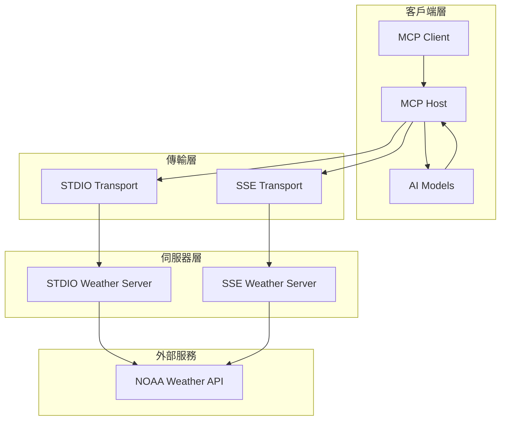

# MCP Weather Sample

> 一個完整的 Model Context Protocol (MCP) 示範專案，展示如何整合天氣服務與多種 AI 模型。

## 專案簡介

MCP Weather Sample 是一個基於 MCP (Model Context Protocol) 的示範應用程式，展示如何建立一個完整的客戶端-伺服器架構，整合天氣 API 服務與多種 AI 模型 (Claude、GPT、Gemini)。專案支援兩種傳輸模式：STDIO 和 SSE (Server-Sent Events)，提供靈活的部署選項。

### 核心功能

- 🌤️ **天氣查詢服務**: 整合 NOAA Weather API，提供即時天氣預報和警報
- 🤖 **多 AI 模型支援**: 支援 Anthropic Claude、OpenAI GPT 和 Google Gemini 模型
- 🔄 **雙傳輸模式**: 支援 STDIO（本地）和 SSE（遠端）兩種連接方式
- 🔐 **安全認證**: 內建 API 金鑰驗證機制
- ⚡ **異步架構**: 全面使用 Python asyncio 提供高效能處理
- 🛠️ **工具導向**: 基於 MCP 工具呼叫模式的 AI 互動

### 技術亮點

- **現代 Python**: 使用 Python 3.12+ 的最新特性
- **FastAPI 整合**: 使用 FastAPI 和 FastMCP 建構 SSE 伺服器
- **模組化設計**: 清晰的客戶端和伺服器分離架構
- **配置驅動**: 透過 JSON 配置文件管理多伺服器設定

## 技術堆疊

### 核心框架
- **Python 3.12+**: 主要開發語言
- **MCP >=1.12.2**: Model Context Protocol 核心框架
- **FastAPI >=0.116.1**: 現代 Web 框架（SSE 模式）
- **FastMCP**: 基於 FastAPI 的 MCP 伺服器實現

### AI 模型整合
- **Anthropic >=0.59.0**: Claude AI 模型
- **OpenAI >=1.97.1**: GPT 模型
- **Google GenAI >=1.27.0**: Gemini 模型

### 網路與資料處理
- **httpx >=0.28.1**: 異步 HTTP 客戶端
- **jsonschema >=4.25.0**: JSON Schema 驗證
- **python-dotenv >=1.1.1**: 環境變數管理

## 快速開始

### 環境需求

- Python 3.12 或更高版本
- UV 套件管理器（建議）或 pip
- 有效的 API 金鑰：
  - NOAA Weather API（免費）
  - AI 模型 API 金鑰（Anthropic、OpenAI 或 Google）

### 安裝步驟

1. **複製專案**
   ```bash
   git clone <repository-url>
   cd mcp-sample
   ```

2. **安裝依賴**
   ```bash
   # 使用 UV（建議）
   uv sync
   ```

3. **配置環境變數**
   ```bash
   # 建立 .env 檔案
   cp .env.example .env
   
   # 編輯 .env 檔案，添加您的 API 金鑰
   ANTHROPIC_API_KEY=your_anthropic_key
   OPENAI_API_KEY=your_openai_key
   GOOGLE_API_KEY=your_google_key
   ```

4. **設定伺服器配置**
   
   檢查並修改 `servers-config.json` 檔案中的設定：
   ```json
   {
     "mcpServers": {
       "sse_weather": {
         "type": "sse",
         "url": "http://localhost:8080/sse",
         "accessToken": "your_access_token"
       },
       "stdio_weather": {
         "type": "stdio",
         "command": "uv",
         "args": ["run", "python", "weather.py"],
         "cwd": "src/servers/weather/stdio"
       }
     }
   }
   ```

   註意： `your_access_token` 設定在 src/servers/weather/sse/user_db.py 中。   
   ```python
    users = {
        "felix": {
            "api_key": "password123",
            "full_name": "Felix Kewa",
            "role": "admin"
        },
        "alice": {
            "api_key": "alicepass456",
            "full_name": "Alice Johnson",
            "role": "developer"
        },
        "bob": {
            "api_key": "bobsecret789",
            "full_name": "Bob Smith",
            "role": "viewer"
        }
    }   
   ```

### 基本使用範例

#### 1. 啟動 SSE 天氣伺服器

```bash
uv run src/servers/weather/sse/mcp-weather.py
```

#### 2. 啟動 MCP 客戶端

```bash
# 在另一個終端機中
uv run src/client/client.py
```

#### 3. 基本天氣查詢

```base
MCP Client Started!
Type your queries or 'quit' to exit.

Query: 阿拉巴馬州是否有天氣警報？
Calling tool get_alerts with args {'state': 'AL'}]
是的，阿拉巴馬州有多個天氣警報生效中：

**高溫警告
**
*   **北阿拉巴馬州與田納西州中南部部分地區**：預計酷
熱指數將高達華氏106度。
*   **阿拉巴馬州西南部、佛
羅里達州西北部與密西西比州東南部部分地區**：預計酷熱指數將高達
華氏109度。
*   **阿拉巴馬州中部**：包括 Autauga、Bibb
、Blount、Bullock、Calhoun、Chilton、Coosa、Dallas、Elmore、Etowah、F
ayette、Greene、Hale、Jefferson、Lamar、Lowndes、Macon、Marengo、Marion、Montgomery、Perry
、Pickens、Pike、Shelby、St. Clair、Sumter、Talladega、Tallapoosa、Tus
caloosa、Walker 與 Winston 等郡，預計酷熱指數將高達華氏106度。


高溫與高濕度可能導致與高溫相關的疾病。建議多喝水、待在有空調
的室內、避免日曬，並關心親友鄰居。在戶外時需格外小心，穿
著輕便寬鬆的衣物，並盡量將劇烈活動安排在清晨或傍晚。

**
離岸流聲明**
*   **阿拉巴馬州沿海地區（Mobile Coastal, Baldwin Coastal）
與佛羅里達州沿海地區**：有危險的離岸流。離岸流即使對
泳技最好的人也可能造成危險，將他們從岸邊捲入深水區。建議在有救生員
看管的區域游泳。若被捲入離岸流，請保持冷靜並漂浮，不要逆
流游泳。
```

## 架構概覽



## 主要元件

### MCP 客戶端 (`src/client/client.py`)
- **MCPClient**: 單一 MCP 伺服器連接管理
- **MCPHost**: 多伺服器管理和 AI 模型整合
- **ModelVendor**: AI 模型供應商枚舉

### 天氣伺服器
- **STDIO 模式** (`src/servers/weather/stdio/weather.py`): 本地標準輸入輸出連接
- **SSE 模式** (`src/servers/weather/sse/mcp-weather.py`): HTTP SSE 遠端連接

### 提供的工具
- `get_alerts`: 獲取美國州份的天氣警報
- `get_forecast`: 獲取指定座標的詳細天氣預報

## 進階功能

### 工具權限控制
透過 `servers-config.json` 精確控制每個伺服器可使用的工具：

```json
{
  "allowedTools": ["get_alerts", "get_forecast"],
  "notAllowedTools": ["get_forecast"]
}
```

### API 金鑰管理
SSE 模式支援多種認證方式：
- HTTP Header: `x-api-key`
- Bearer Token: `Authorization: Bearer <token>`
- Query Parameter: `?api_key=<key>`

## 文件導覽

- **[快速開始指南](docs/getting-started.md)**: 詳細的安裝和設定教學
- **[使用者指南](docs/user-guide.md)**: 完整的使用說明和範例
- **[開發者指南](docs/developer-guide.md)**: 開發環境設定和貢獻指南
- **[架構文件](docs/architecture.md)**: 系統架構深度解析

## 授權條款

本專案採用 [MIT 授權條款](LICENSE)。

## 貢獻指南

歡迎參與專案貢獻！請參閱 [貢獻指南](CONTRIBUTING.md) 了解如何：
- 回報問題
- 提交功能請求
- 提供程式碼貢獻
- 改進文件

## 支援與回饋

如有問題或建議，請：
1. 查閱 [常見問題](docs/getting-started.md#常見問題)
2. 搜尋現有的 [Issues](../../issues)
3. 建立新的 Issue 或 Discussion

---

**開始您的 MCP 之旅！** 🚀 探索如何用 Model Context Protocol 建構智慧應用程式。