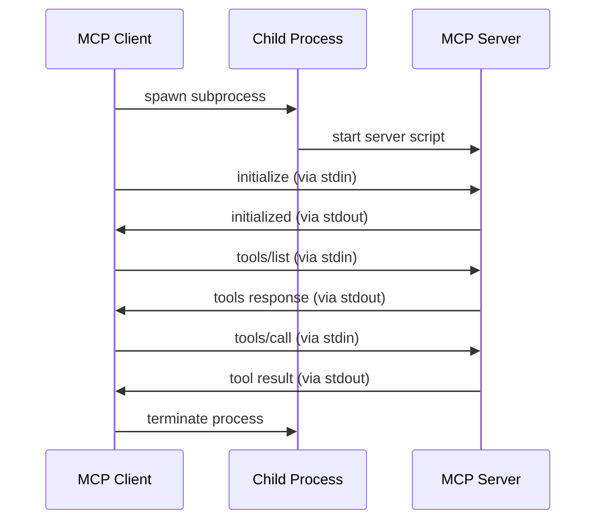
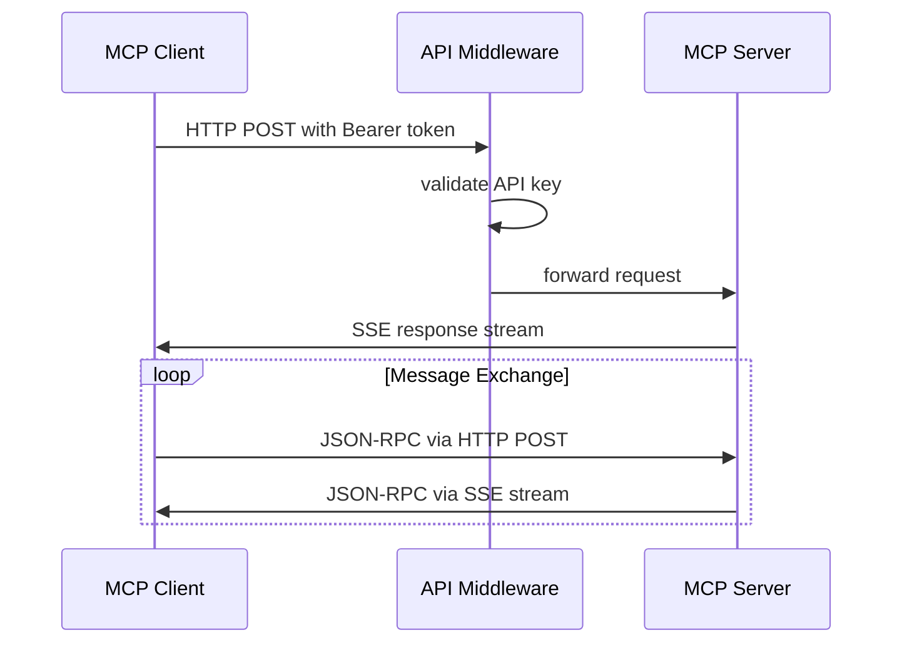

# MCP 協定文件

## 概述

Model Context Protocol (MCP) 是一個標準化的協定，用於 AI 模型與外部工具和資源之間的通訊。本文件詳細說明 MCP 協定的基礎概念、訊息格式、傳輸模式，以及在本專案中的具體實現。

## MCP 協定基礎概念

### 核心架構

```mermaid
graph TB
    subgraph "MCP 生態系統"
        Client[MCP Client<br/>AI應用程式]
        Server[MCP Server<br/>工具/資源提供者]
        Protocol[MCP Protocol<br/>JSON-RPC 2.0]
    end
    
    Client <-->|JSON-RPC Messages| Protocol
    Protocol <-->|Tool Calls & Resources| Server
    
    subgraph "傳輸層"
        STDIO[Standard I/O]
        SSE[Server-Sent Events]
        WebSocket[WebSocket<br/>(未來支援)]
    end
    
    Protocol --> STDIO
    Protocol --> SSE
    Protocol --> WebSocket
```

### 主要概念

#### 1. 工具 (Tools)
- **定義**: 可由 AI 模型調用的函數或服務
- **用途**: 執行特定任務，如獲取資料、計算、外部 API 調用
- **特點**: 有明確的輸入參數和輸出格式

#### 2. 資源 (Resources)
- **定義**: 可被讀取的資料來源
- **用途**: 提供上下文資訊、配置資料、文件內容
- **特點**: 通過 URI 識別，支援不同類型的內容

#### 3. 提示 (Prompts)
- **定義**: 預定義的提示模板
- **用途**: 標準化 AI 模型的輸入格式
- **特點**: 支援參數化和條件邏輯

## 訊息格式和結構

### JSON-RPC 2.0 基礎

MCP 協定基於 JSON-RPC 2.0 標準，所有訊息都遵循以下基本結構：

```json
{
  "jsonrpc": "2.0",
  "id": "unique-request-id",
  "method": "method_name",
  "params": {
    // 方法參數
  }
}
```

### 核心訊息類型

#### 1. 初始化訊息

**客戶端初始化請求：**
```json
{
  "jsonrpc": "2.0",
  "id": 1,
  "method": "initialize",
  "params": {
    "protocolVersion": "2024-11-05",
    "capabilities": {
      "tools": {},
      "resources": {},
      "prompts": {}
    },
    "clientInfo": {
      "name": "MCP Weather Client",
      "version": "1.0.0"
    }
  }
}
```

**伺服器初始化回應：**
```json
{
  "jsonrpc": "2.0",
  "id": 1,
  "result": {
    "protocolVersion": "2024-11-05",
    "capabilities": {
      "tools": {
        "listChanged": true
      },
      "resources": {
        "subscribe": true,
        "listChanged": true
      },
      "prompts": {
        "listChanged": true
      }
    },
    "serverInfo": {
      "name": "Weather MCP Server",
      "version": "1.0.0"
    }
  }
}
```

#### 2. 工具相關訊息

**列出工具請求：**
```json
{
  "jsonrpc": "2.0",
  "id": 2,
  "method": "tools/list"
}
```

**列出工具回應：**
```json
{
  "jsonrpc": "2.0",
  "id": 2,
  "result": {
    "tools": [
      {
        "name": "get_forecast",
        "description": "Get weather forecast for a location",
        "inputSchema": {
          "type": "object",
          "properties": {
            "latitude": {
              "type": "number",
              "description": "Latitude of the location"
            },
            "longitude": {
              "type": "number", 
              "description": "Longitude of the location"
            }
          },
          "required": ["latitude", "longitude"]
        }
      },
      {
        "name": "get_alerts",
        "description": "Get weather alerts for a US state",
        "inputSchema": {
          "type": "object",
          "properties": {
            "state": {
              "type": "string",
              "description": "Two-letter US state code"
            }
          },
          "required": ["state"]
        }
      }
    ]
  }
}
```

**調用工具請求：**
```json
{
  "jsonrpc": "2.0",
  "id": 3,
  "method": "tools/call",
  "params": {
    "name": "get_forecast",
    "arguments": {
      "latitude": 40.7128,
      "longitude": -74.0060
    }
  }
}
```

**調用工具回應：**
```json
{
  "jsonrpc": "2.0",
  "id": 3,
  "result": {
    "content": [
      {
        "type": "text",
        "text": "Tonight:\nTemperature: 45°F\nWind: 10 mph W\nForecast: Clear skies with light winds..."
      }
    ],
    "isError": false
  }
}
```

#### 3. 資源相關訊息

**列出資源請求：**
```json
{
  "jsonrpc": "2.0",
  "id": 4,
  "method": "resources/list"
}
```

**列出資源回應：**
```json
{
  "jsonrpc": "2.0",
  "id": 4,
  "result": {
    "resources": [
      {
        "uri": "weather://logs",
        "name": "Weather Service Logs",
        "description": "Application logs for the weather service",
        "mimeType": "text/plain"
      }
    ]
  }
}
```

**讀取資源請求：**
```json
{
  "jsonrpc": "2.0",
  "id": 5,
  "method": "resources/read",
  "params": {
    "uri": "weather://logs"
  }
}
```

**讀取資源回應：**
```json
{
  "jsonrpc": "2.0",
  "id": 5,
  "result": {
    "contents": [
      {
        "uri": "weather://logs",
        "mimeType": "text/plain",
        "text": "2024-07-26 10:00:00 - Weather service started\n2024-07-26 10:01:00 - Connected to NOAA API\n..."
      }
    ]
  }
}
```

#### 4. 提示相關訊息

**列出提示請求：**
```json
{
  "jsonrpc": "2.0",
  "id": 6,
  "method": "prompts/list"
}
```

**獲取提示請求：**
```json
{
  "jsonrpc": "2.0",
  "id": 7,
  "method": "prompts/get",
  "params": {
    "name": "weather_analysis",
    "arguments": {
      "location": "New York"
    }
  }
}
```

#### 5. 通知訊息

**日誌通知：**
```json
{
  "jsonrpc": "2.0",
  "method": "notifications/message",
  "params": {
    "level": "info",
    "logger": "weather.forecast",
    "data": "Successfully fetched forecast for coordinates (40.7128, -74.0060)"
  }
}
```

**進度通知：**
```json
{
  "jsonrpc": "2.0",
  "method": "notifications/progress", 
  "params": {
    "progressToken": "forecast_123",
    "progress": 75,
    "total": 100
  }
}
```

## 傳輸模式對比

### 1. STDIO 傳輸模式

#### 特點
- **本地通訊**: 進程間標準輸入/輸出通訊
- **簡單設定**: 無需網路配置
- **安全性**: 本地執行，無網路暴露風險
- **效能**: 低延遲，高效率

#### 訊息流程


#### 實現範例
```python
# 客戶端程式碼
server_params = StdioServerParameters(
    command="uv",
    args=["run", "python", "weather.py"],
    cwd="src/servers/weather/stdio"
)

# 建立 STDIO 連接
stdio_transport = await stdio_client(server_params)
stdio, write = stdio_transport

# 建立會話
session = ClientSession(
    read_stream=stdio,
    write_stream=write
)

await session.initialize()
```

### 2. SSE 傳輸模式

#### 特點
- **遠端通訊**: HTTP/SSE 協定
- **Web 標準**: 基於標準 HTTP 技術
- **認證支援**: 內建 API 金鑰認證
- **擴展性**: 支援負載平衡和分散式部署

#### 訊息流程


#### 實現範例
```python
# 客戶端程式碼
sse_params = {
    "url": "http://localhost:8080/sse",
    "headers": {
        "Authorization": "Bearer your_api_key"
    },
    "timeout": 30
}

# 建立 SSE 連接
streams_context = sse_client(**sse_params)
read_stream, write_stream = await streams_context.__aenter__()

# 建立會話
session = ClientSession(
    read_stream=read_stream,
    write_stream=write_stream
)

await session.initialize()
```

### 3. 傳輸模式選擇指南

| 特性 | STDIO | SSE |
|------|-------|-----|
| **部署複雜度** | 低 | 中等 |
| **網路需求** | 無 | HTTP/HTTPS |
| **認證機制** | 無 | API 金鑰 |
| **擴展性** | 低 | 高 |
| **除錯難度** | 低 | 中等 |
| **適用場景** | 開發、本地部署 | 生產、分散式 |

## 協定擴展機制

### 1. 自訂工具類型

```python
@mcp.tool()
async def custom_analysis(data: str, analysis_type: str) -> str:
    """
    自訂分析工具
    
    Args:
        data: 要分析的資料
        analysis_type: 分析類型 (sentiment, summary, translation)
    """
    # 工具邏輯實現
    pass
```

對應的 JSON Schema：
```json
{
  "name": "custom_analysis",
  "description": "自訂分析工具",
  "inputSchema": {
    "type": "object",
    "properties": {
      "data": {
        "type": "string",
        "description": "要分析的資料"
      },
      "analysis_type": {
        "type": "string",
        "enum": ["sentiment", "summary", "translation"],
        "description": "分析類型"
      }
    },
    "required": ["data", "analysis_type"]
  }
}
```

### 2. 自訂資源類型

```python
@mcp.resource("custom://config/{config_name}")
async def get_config(config_name: str) -> str:
    """獲取自訂配置"""
    config_data = load_config(config_name)
    return json.dumps(config_data)
```

### 3. 中介軟體擴展

```python
class CustomAuthMiddleware(BaseHTTPMiddleware):
    """自訂認證中介軟體"""
    
    async def dispatch(self, request: Request, call_next):
        # 自訂認證邏輯
        auth_token = request.headers.get("X-Custom-Auth")
        
        if not self.validate_custom_auth(auth_token):
            return JSONResponse(
                status_code=401,
                content={"error": "Custom authentication failed"}
            )
        
        return await call_next(request)
```

## 相容性考量

### 1. 協定版本管理

```python
# 支援多版本協定
SUPPORTED_PROTOCOL_VERSIONS = [
    "2024-11-05",  # 當前版本
    "2024-10-07",  # 舊版本支援
]

def check_protocol_compatibility(client_version: str) -> bool:
    """檢查協定版本相容性"""
    return client_version in SUPPORTED_PROTOCOL_VERSIONS
```

### 2. 功能檢測

```python
def get_capabilities() -> dict:
    """獲取伺服器功能"""
    return {
        "tools": {
            "listChanged": True,
            "progressReporting": True
        },
        "resources": {
            "subscribe": True,
            "listChanged": True
        },
        "prompts": {
            "listChanged": True
        },
        "experimental": {
            "customAuth": True,
            "binaryData": False
        }
    }
```

### 3. 向後相容性策略

- **漸進式棄用**: 舊功能標記為已棄用但仍支援
- **版本協商**: 客戶端和伺服器協商使用的協定版本
- **預設行為**: 不支援的功能使用安全的預設行為

## 錯誤處理機制

### 1. 標準錯誤格式

```json
{
  "jsonrpc": "2.0",
  "id": 1,
  "error": {
    "code": -32602,
    "message": "Invalid params",
    "data": {
      "parameter": "latitude",
      "reason": "must be a number between -90 and 90"
    }
  }
}
```

### 2. 錯誤代碼對照

| 代碼 | 含義 | 說明 |
|------|------|------|
| -32700 | Parse error | JSON 解析錯誤 |
| -32600 | Invalid Request | 無效的請求 |
| -32601 | Method not found | 方法不存在 |
| -32602 | Invalid params | 無效參數 |
| -32603 | Internal error | 內部錯誤 |
| -32000 | Server error | 伺服器錯誤 |

### 3. 錯誤處理最佳實務

```python
async def safe_tool_call(tool_name: str, args: dict) -> dict:
    """安全的工具調用"""
    try:
        result = await execute_tool(tool_name, args)
        return {
            "content": [{"type": "text", "text": result}],
            "isError": False
        }
    except ValidationError as e:
        return {
            "content": [{"type": "text", "text": f"Validation error: {e}"}],
            "isError": True
        }
    except Exception as e:
        return {
            "content": [{"type": "text", "text": f"Execution error: {e}"}],
            "isError": True
        }
```

## 效能最佳化建議

### 1. 連接管理

```python
class MCPConnectionPool:
    """MCP 連接池"""
    
    def __init__(self, max_connections: int = 10):
        self.pool = asyncio.Queue(maxsize=max_connections)
        self.active_connections = 0
    
    async def get_connection(self) -> ClientSession:
        """獲取連接"""
        if self.pool.empty() and self.active_connections < self.max_connections:
            return await self.create_connection()
        return await self.pool.get()
    
    async def return_connection(self, connection: ClientSession):
        """歸還連接"""
        await self.pool.put(connection)
```

### 2. 快取策略

```python
from functools import lru_cache
import asyncio

class MCPCache:
    """MCP 結果快取"""
    
    def __init__(self, ttl: int = 300):
        self.cache = {}
        self.ttl = ttl
    
    async def get_cached_tool_result(self, tool_name: str, args: dict):
        """獲取快取的工具結果"""
        cache_key = f"{tool_name}:{hash(str(args))}"
        
        if cache_key in self.cache:
            result, timestamp = self.cache[cache_key]
            if time.time() - timestamp < self.ttl:
                return result
        
        return None
    
    async def cache_tool_result(self, tool_name: str, args: dict, result: any):
        """快取工具結果"""
        cache_key = f"{tool_name}:{hash(str(args))}"
        self.cache[cache_key] = (result, time.time())
```

### 3. 批次處理

```python
async def batch_tool_calls(tool_calls: List[dict]) -> List[dict]:
    """批次處理工具調用"""
    tasks = []
    for call in tool_calls:
        task = execute_tool(call["name"], call["args"])
        tasks.append(task)
    
    results = await asyncio.gather(*tasks, return_exceptions=True)
    
    formatted_results = []
    for i, result in enumerate(results):
        if isinstance(result, Exception):
            formatted_results.append({
                "error": str(result),
                "isError": True
            })
        else:
            formatted_results.append({
                "content": [{"type": "text", "text": result}],
                "isError": False
            })
    
    return formatted_results
```

## 安全性考量

### 1. 輸入驗證

```python
import jsonschema

def validate_tool_input(tool_schema: dict, args: dict) -> bool:
    """驗證工具輸入"""
    try:
        jsonschema.validate(args, tool_schema)
        return True
    except jsonschema.ValidationError:
        return False
```

### 2. 權限控制

```python
class PermissionManager:
    """權限管理器"""
    
    def __init__(self):
        self.user_permissions = {}
    
    def check_tool_permission(self, user_id: str, tool_name: str) -> bool:
        """檢查工具權限"""
        user_perms = self.user_permissions.get(user_id, {})
        allowed_tools = user_perms.get("allowed_tools", [])
        denied_tools = user_perms.get("denied_tools", [])
        
        if tool_name in denied_tools:
            return False
        
        if not allowed_tools or tool_name in allowed_tools:
            return True
        
        return False
```

### 3. 資料隱私

```python
def sanitize_sensitive_data(data: dict) -> dict:
    """清理敏感資料"""
    sensitive_keys = ["password", "api_key", "token", "secret"]
    
    sanitized = data.copy()
    for key in sensitive_keys:
        if key in sanitized:
            sanitized[key] = "***REDACTED***"
    
    return sanitized
```

MCP 協定提供了強大且靈活的框架，用於 AI 模型與外部工具的整合。透過理解和正確實現這些協定標準，可以建立可靠、可擴展且安全的 AI 應用系統。