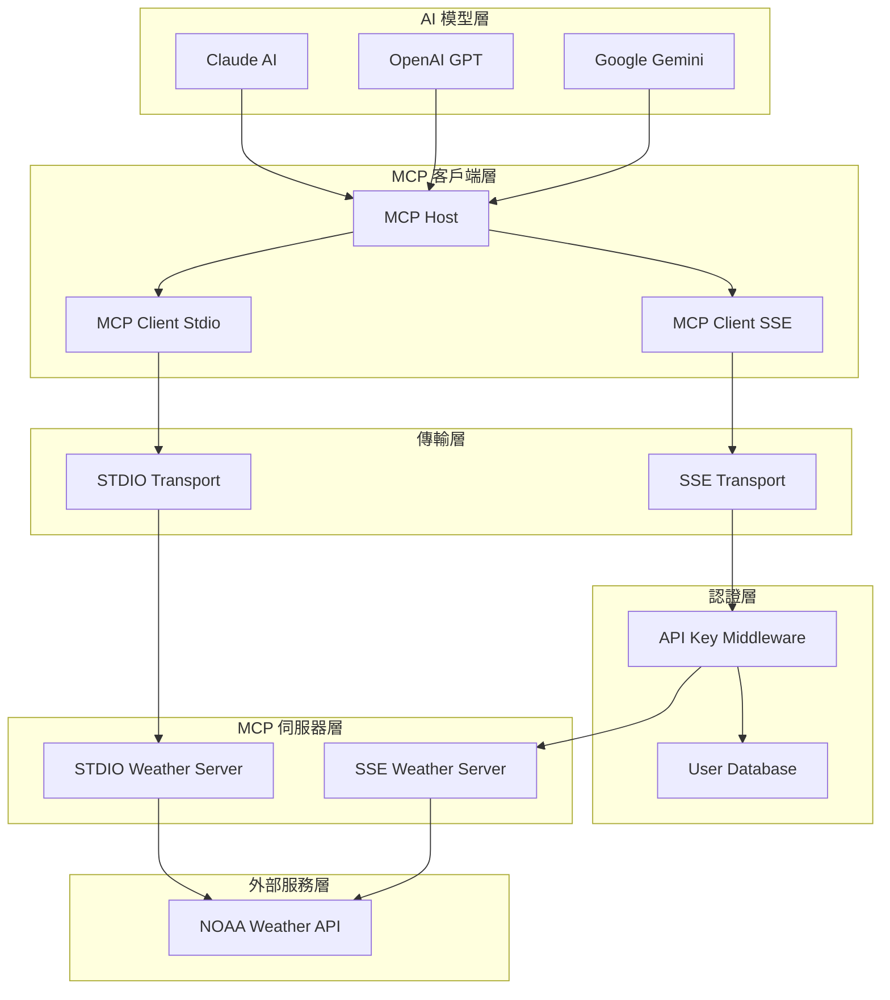
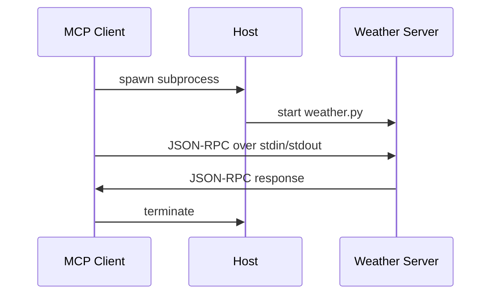
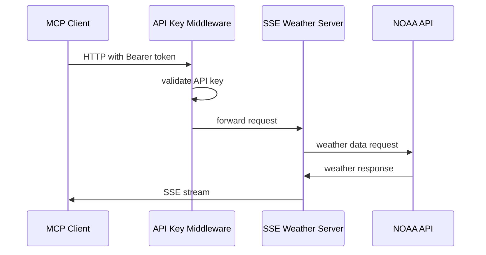
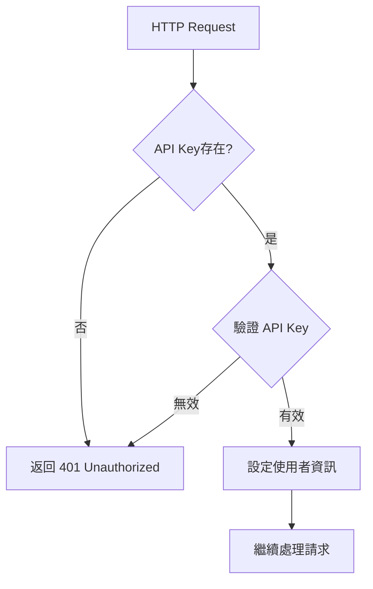
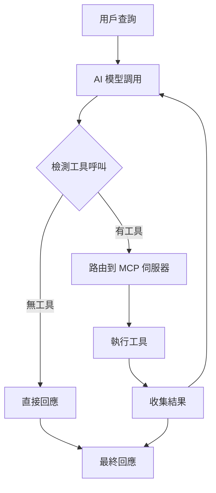

# 系統架構文件

## 概述

MCP Weather Sample 是一個基於 Model Context Protocol (MCP) 的分散式天氣服務系統，展示了如何整合多個 AI 模型與工具服務，並支援兩種不同的傳輸協定（STDIO 和 SSE）。

## 架構總覽



## 核心元件架構

### 1. MCP 協定實現

#### MCP Client (MCPClient)
```python
class MCPClient:
    - server_name: str
    - session: ClientSession
    - transport_type: "stdio" | "sse"
```

**主要功能：**
- 管理單一 MCP 伺服器連接
- 支援 STDIO 和 SSE 兩種傳輸模式
- 提供工具呼叫、資源讀取、提示管理介面
- 實現異步操作和錯誤處理

#### MCP Host (MCPHost)
```python
class MCPHost:
    - mcp_clients: List[MCPClient]
    - model_vendor: ModelVendor
    - anthropic: Anthropic
    - openai: OpenAI
    - google_client: genai.Client
```

**主要功能：**
- 管理多個 MCP 客戶端實例
- 整合多種 AI 模型（Anthropic、OpenAI、Google）
- 協調工具呼叫和對話流程
- 處理不同模型的 API 格式轉換

### 2. 傳輸層架構

#### STDIO 傳輸模式


**特點：**
- 本地進程間通訊
- 無需網路連接
- 適合開發和本地部署
- 自動進程管理

#### SSE 傳輸模式


**特點：**
- HTTP/SSE 協定
- 支援遠端部署
- 內建認證機制
- 適合生產環境

### 3. 伺服器架構詳細說明

#### STDIO Weather Server
```python
# 檔案：src/servers/weather/stdio/weather.py
FastMCP("Weather")
- get_alerts(state: str)
- get_forecast(latitude: float, longitude: float)
```

**架構特點：**
- 純 MCP STDIO 實現
- 直接與 NOAA API 整合
- 無認證機制
- 輕量級設計

#### SSE Weather Server
```python
# 檔案：src/servers/weather/sse/mcp-weather.py
FastAPI + FastMCP
- APIKeyMiddleware
- get_alerts(state: str)
- get_forecast(latitude: float, longitude: float)
```

**架構特點：**
- FastAPI + FastMCP 整合
- API Key 中介軟體
- 多重認證方式（Header、Bearer、Query）
- RESTful API 設計

### 4. 認證和安全架構

#### API Key 認證流程


#### 認證方式
1. **Header 認證**: `x-api-key: <api_key>`
2. **Bearer Token**: `Authorization: Bearer <api_key>`
3. **查詢參數**: `?api_key=<api_key>`

#### 使用者資料庫架構
```python
users = {
    "username": {
        "api_key": "secret_key",
        "full_name": "User Name",
        "role": "admin|developer|viewer"
    }
}
```

### 5. 異步處理機制

#### 異步操作流程


#### 異步設計原則
- **全異步 I/O**: 所有網路和檔案操作使用 `asyncio`
- **並發處理**: 支援多個同時的工具呼叫
- **資源管理**: 使用 `AsyncExitStack` 管理異步上下文
- **錯誤隔離**: 工具錯誤不會影響整體系統

### 6. AI 模型整合架構

#### 多模型支援設計
```python
class ModelVendor(Enum):
    ANTHROPIC = "anthropic"
    OPENAI = "openai" 
    GOOGLE = "google"
```

#### 工具格式轉換
每個 AI 模型都有不同的工具調用格式，系統實現了統一的轉換機制：

**Anthropic 格式：**
```python
{
    "name": "server_name-tool_name",
    "description": "tool description",
    "input_schema": {...}
}
```

**OpenAI 格式：**
```python
{
    "type": "function",
    "function": {
        "name": "server_name-tool_name",
        "description": "tool description", 
        "parameters": {...}
    }
}
```

**Google 格式：**
```python
types.Tool(function_declarations=[
    types.FunctionDeclaration(
        name="server_name.tool_name",
        description="tool description",
        parameters={...}
    )
])
```

### 7. 配置驅動架構

#### 配置檔案結構
```json
{
  "mcpServers": {
    "server_name": {
      "type": "sse|stdio",
      "url": "http://...",           // SSE 模式
      "command": "python",           // STDIO 模式  
      "args": ["script.py"],         // STDIO 模式
      "accessToken": "token",        // SSE 認證
      "allowedTools": [...],         // 允許的工具
      "notAllowedTools": [...],      // 禁用的工具
      "timeout": 30,                 // 超時設定
      "disabled": false              // 是否禁用
    }
  }
}
```

#### 配置驗證
使用 JSON Schema 驗證配置格式：
- 必要欄位檢查
- 類型驗證
- 條件式驗證（根據傳輸類型）

### 8. 錯誤處理和日誌架構

#### 錯誤處理層級
1. **傳輸層錯誤**: 連接失敗、超時
2. **協定層錯誤**: MCP 協定錯誤
3. **應用層錯誤**: 工具執行錯誤
4. **外部服務錯誤**: NOAA API 錯誤

#### 日誌機制
```python
async def logging_callback(server_name: str, params: LoggingMessageNotificationParams):
    print(f"[{server_name} 日誌回調] {params}")
```

## 技術決策和設計原則

### 1. 協定選擇
- **MCP 1.12.2+**: 標準化的模型-工具通訊協定
- **JSON-RPC**: 輕量級、跨語言的通訊協定
- **HTTP/SSE**: 標準網路協定，支援即時通訊

### 2. 架構原則
- **鬆耦合**: 元件間通過標準介面通訊
- **高內聚**: 每個模組專注單一職責
- **可測試性**: 依賴注入和介面抽象
- **可觀測性**: 完整的日誌和錯誤追蹤

### 3. 安全性考量
- **最小權限**: 工具權限精細控制
- **認證機制**: 多層次 API Key 驗證
- **輸入驗證**: JSON Schema 格式驗證
- **錯誤隔離**: 防止錯誤傳播

### 4. 維護性設計
- **配置外部化**: 所有設定可通過配置檔案調整
- **模組化**: 清晰的檔案和目錄結構
- **文件化**: 完整的程式碼註解和文件
- **版本控制**: 明確的依賴版本管理

這個架構設計確保了系統的靈活性、可擴展性和維護性，同時提供了生產級別的安全性和效能。